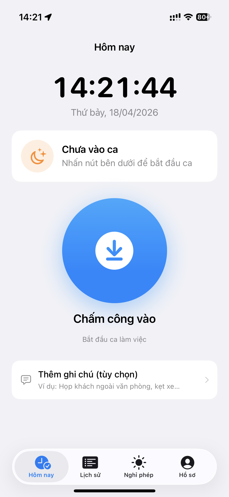
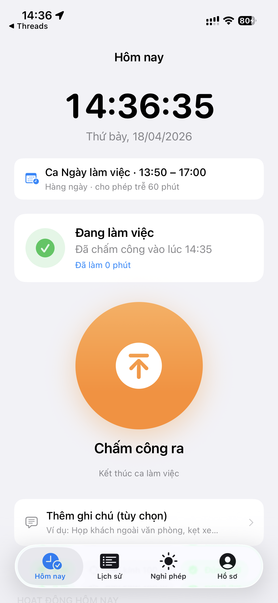
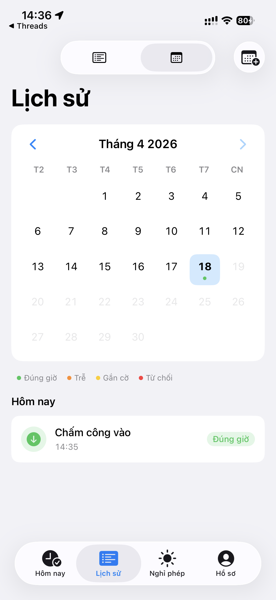
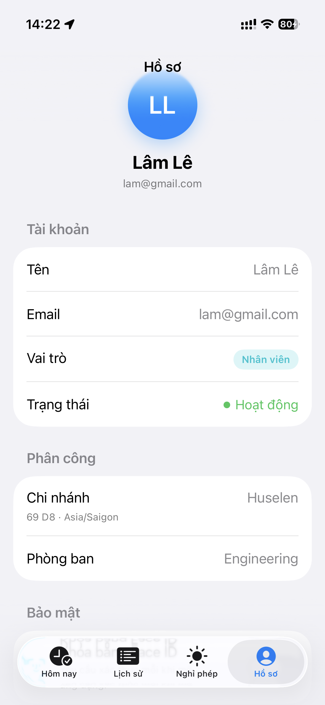
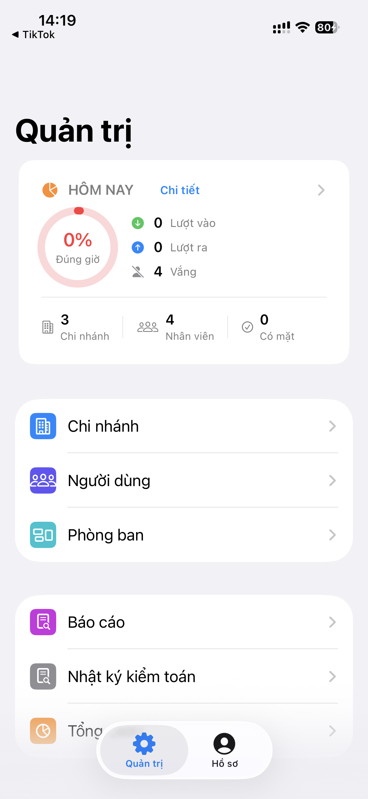

# finosWLb

Ứng dụng iOS chấm công & quản lý thời gian làm việc (work-life balance) cho doanh nghiệp có nhiều chi nhánh. Backend dùng Supabase, client là SwiftUI + SwiftData.

- **Target:** iOS 26.2 · Swift 5.0 · iPhone + iPad
- **Bundle id:** `vietmind.finosWLb`
- **Ngôn ngữ UI:** Tiếng Việt

## Screenshots

<table>
  <tr>
    <td align="center" width="20%">
      <br/>
      <sub><b>Nhân viên · Hôm nay</b><br/>Chưa vào ca, sẵn sàng chấm công vào</sub>
    </td>
    <td align="center" width="20%">
      <br/>
      <sub><b>Nhân viên · Đang trong ca</b><br/>Hiển thị ca làm việc + thời gian đã làm</sub>
    </td>
    <td align="center" width="20%">
      <br/>
      <sub><b>Nhân viên · Lịch sử</b><br/>Calendar view với chú thích trạng thái</sub>
    </td>
    <td align="center" width="20%">
      <br/>
      <sub><b>Nhân viên · Hồ sơ</b><br/>Chi nhánh, phòng ban, cài đặt bảo mật</sub>
    </td>
    <td align="center" width="20%">
      <br/>
      <sub><b>Quản trị · Dashboard</b><br/>KPI hôm nay + shortcut quản lý</sub>
    </td>
  </tr>
</table>

## Tech stack

| Lớp | Công nghệ |
|---|---|
| UI | SwiftUI (MainActor-by-default), `@Observable` stores |
| Persistence (local) | SwiftData — hàng đợi `PendingCheckIn` offline |
| Backend | Supabase (Auth · PostgREST · Edge Functions · RLS) |
| Auth | Supabase Auth (email/password) + Biometric Lock (Face ID / Touch ID) |
| Location | CoreLocation (`LocationService`) |
| Wi-Fi | `NEHotspotNetwork` — entitlement `com.apple.developer.networking.wifi-info` |
| Logging | `OSLog` thông qua `AppLog.*` (auth, checkin, network, …) |
| Widget | WidgetKit + ActivityKit (Live Activity) — extension `finosWidget` |
| Test | XCTest — target `finosWLbTests` |

Không dùng SwiftPM manifest / CocoaPods / Carthage. Dependency (Supabase SDK) quản lý trong Xcode project.

## Kiến trúc

### Phân lớp thư mục

```
finosWLb/
├── App/           # RootView, OnboardingView, LockScreen — điều phối top-level
├── Core/          # Logic nghiệp vụ & service layer (không chứa view)
│   ├── Auth/          AuthStore, SignIn/SignUpView
│   ├── Cache/         PendingCheckIn (@Model SwiftData, offline queue)
│   ├── CheckIn/       CheckInService, CheckInServerError
│   ├── Location/      LocationService
│   ├── Logging/       AppLogger (OSLog categories)
│   ├── Models/        Codable DTOs + domain enums (UserRole, AttendanceEvent, …)
│   ├── Notifications/ NotificationService
│   ├── Security/      BiometricLock
│   ├── Supabase/      SupabaseManager + Secrets (gitignored)
│   └── WiFi/          WiFiService
├── Features/      # Tách theo vai trò — mỗi vai trò một root + màn con
│   ├── Admin/         Dashboard, Users, Branches, Departments, Shifts, Audit, Reports
│   ├── Manager/       Review queue, Leave/Correction review, Branch overview, Reports
│   └── Employee/      TodayView (check-in), Calendar, History, Leaves, Corrections
├── Shared/        # UI tái sử dụng: KPITile, StatusBadge, ScopePicker, ExportSheet …
└── Assets.xcassets
finosWidget/       # Widget + Live Activity extension
finosWLbTests/     # Unit tests
```

### Các ràng buộc kiến trúc

- **Xcode file-system synchronized group.** Thư mục `finosWLb/` khai báo `PBXFileSystemSynchronizedRootGroup` — thêm/xoá file `.swift` vào đĩa là tự động biên dịch. **Không** sửa `project.pbxproj` để đăng ký file mới; chỉ đụng vào cho build settings / target / dependency.
- **MainActor-by-default.** Project bật `SWIFT_DEFAULT_ACTOR_ISOLATION = MainActor` và `SWIFT_APPROACHABLE_CONCURRENCY = YES`. Mọi type mặc định là `@MainActor`; công việc nền phải đánh dấu `nonisolated` hoặc dời sang actor riêng.
- **Single Supabase client.** `SupabaseManager.shared` giữ một `SupabaseClient`. Edge Function gọi qua `client.invokeFunction(_:body:)` — helper này đính JWT hiện hành vào `Authorization` và chuẩn hoá lỗi thành `InvokeError.edgeFunctionError(statusCode, code, detail)`.
- **Vai trò & RLS.** Ba vai trò cố định: `admin` / `manager` / `employee` (xem `UserRole`). Authorization thực thi ở Postgres qua RLS + Edge Function; client chỉ quyết định điều hướng UI.
- **Offline-first check-in.** `CheckInService` thử submit trực tiếp; mất mạng thì enqueue `PendingCheckIn` (SwiftData) để retry sau. Model này được đăng ký trong `Schema([PendingCheckIn.self])` ở `finosWLbApp.swift` — thêm `@Model` mới phải cập nhật schema này.
- **Biometric Lock.** `BiometricLock` khoá app khi `scenePhase == .background`; mở khoá bằng Face ID/Touch ID trong `LockScreen`.

## Conventions

### Swift / SwiftUI

- **State stores**: `@Observable` + `@MainActor final class`; bơm qua `.environment(...)` ở `finosWLbApp`.
- **Models**: DTO `Codable` thường map snake_case Postgres → camelCase Swift bằng `CodingKeys`.
- **Concurrency**: `async/await`, không dùng Combine. I/O chạy trên background bằng `nonisolated` hoặc task detach.
- **Error handling**: enum `LocalizedError` ở ranh giới (ví dụ `CheckInError`, `InvokeError`); UI đọc `errorDescription`.
- **User-facing copy**: tiếng Việt, đặt trực tiếp trong enum/`errorDescription` (chưa dùng `String Catalog`).
- **Logging**: `AppLog.<category>.info/debug/error("…")` — không dùng `print`. JWT/PII đánh dấu `privacy: .private`; chỉ log prefix/role khi cần (xem `SupabaseClient.tokenPrefix`).

### Commit & branch

- Branch chính: `main`. Branch hiện tại: `redesign-uiux`.
- Commit message ngắn gọn, mô tả thay đổi nghiệp vụ (xem `git log`).

### Secrets

- `finosWLb/Core/Supabase/Secrets.swift` **không** commit — clone xong copy từ `Secrets.swift.example` rồi điền `supabaseURL`, `supabaseAnonKey`.

## Commands

Build (Debug, iOS Simulator):

```bash
xcodebuild -project finosWLb.xcodeproj \
  -scheme finosWLb \
  -configuration Debug \
  -destination 'generic/platform=iOS Simulator' build
```

Clean:

```bash
xcodebuild -project finosWLb.xcodeproj -scheme finosWLb clean
```

Test: mở Xcode chạy ⌘U (target `finosWLbTests`).

Thực tế dev hằng ngày dùng Xcode (⌘R / ⌘U).

## Tính năng đã có

- **Auth**: đăng nhập, tự đăng ký (mặc định `employee`, chờ admin active), auto-refresh session, Biometric Lock khi background.
- **Check-in / Check-out** (Employee): định vị GPS + Wi-Fi BSSID, offline queue, mã lỗi server chuẩn hoá (`CheckInServerError`).
- **Lịch & Lịch sử** (Employee): xem theo ngày/tuần/tháng, gửi yêu cầu chỉnh sửa (correction).
- **Leave requests** (Employee): tạo, theo dõi trạng thái.
- **Duyệt** (Manager): hàng đợi review — leave, correction, sự kiện bị flag; chỉnh event, xem báo cáo theo chi nhánh.
- **Admin**:
  - Dashboard + Quick stats
  - Users (mời qua email, gán branch/department/role, active/inactive)
  - Branches (geo-fence, danh sách Wi-Fi hợp lệ)
  - Departments
  - Shifts (ca làm việc)
  - Audit log
  - Reports & export
- **Notifications**: `NotificationService` — quyền & dispatch cục bộ.

## Tính năng sắp phát triển

> Đánh dấu theo mức độ sẵn sàng — `[scaffold]` nghĩa là extension/skeleton đã có nhưng chưa nối vào luồng chính.

- **Home Screen Widget** `[scaffold]` — hiển thị trạng thái chấm công hôm nay, nút check-in nhanh (target `finosWidget`).
- **Live Activity** `[scaffold]` — theo dõi ca đang mở trên Lock Screen / Dynamic Island (`finosWidgetLiveActivity.swift`).
- **Control Widget** `[scaffold]` — shortcut check-in trong Control Center (`finosWidgetControl.swift`).
- **App Intents** `[scaffold]` — chấm công qua Siri / Shortcuts (`AppIntent.swift`).
- **Push notifications**: nhắc chấm công, thông báo duyệt leave/correction (hiện mới có local notifications).
- **Export nâng cao**: CSV/XLSX theo khoảng tuỳ chọn, gửi email trực tiếp từ app.
- **Đa ngôn ngữ**: tách chuỗi UI sang String Catalog (hiện hard-code tiếng Việt).
- **Dark Mode polish** và hoàn thiện redesign UI/UX (đang trên branch `redesign-uiux`).
- **Unit test coverage**: mở rộng cho `CheckInService` end-to-end (hiện cover message + error mapping).

## Tham khảo nhanh

- Cấu hình Claude Code & hướng dẫn dự án: `CLAUDE.md`
- Nhật ký prompt làm việc với AI: `PROMPT_LOG.md`
- Entitlements: `finosWLb/finosWLb.entitlements`
